# 客户端安装

## 一、Java的安装

官方网站：[Java Downloads | Oracle](https://www.oracle.com/java/technologies/downloads/)

**MC Java版（Minecraft Java Edition），** 是由 **Java 语言** 编写的，只能在 **JVM虚拟机** 中运行，这个 **JVM虚拟机** 其实也就是一个程序，被包含在官方发布的 **Java软件包** 中。

开发 **Java语言** 的公司叫做 **甲骨文（Oracle）**，以前 **Oracle** 发布的 **Java软件包** 分为两种：

- JRE（Java Runtime Environment）为想要运行Java程序的人准备
- JDK（Java Development Kit）       为想要运行、开发Java程序的人准备

其中后者包含前者，他们都包含有 **JVM虚拟机** 程序。

不过自 **Java11** 起，**Oracle** 就不再单独提供 **JRE** 了，也就是说，只剩下了 **JDK**（所以下载 **JDK** 安装就好了）。

要注意的是自 **MC 1.18** 起，只有 **Java17** 及以上版本的 **Java** 才可以运行 **MC**。

打开上面的链接，可以看到下载列表：

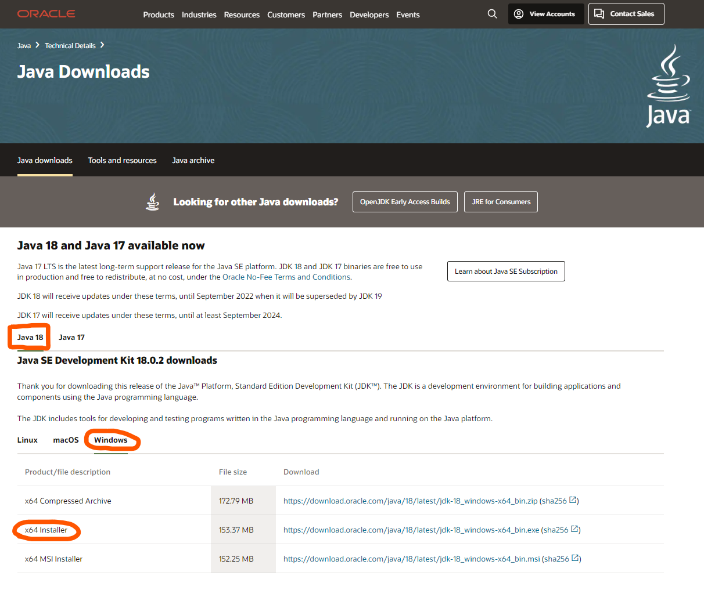

可以直接无脑选最新版的 Java，然后选择对应的系统，下载、安装即可。

如果你不知道下哪个：

- 对于 Windows 系统，下载 `Windows` 下的 `x64 Installer` 文件并一路下一步安装就好了。
- 对于 Mac 和 Linux 系统，想必你知道下哪个。

## 二、Minecraft启动器的选择

> 如果不知道选哪个，那就先选 HMCL

### 1、正版启动器

官方的启动器，有利有弊。（但是我不常用）

MC官方网站：[官方网站 | Minecraft](https://www.minecraft.net/zh-hans)

登陆后，获取 Minecraft -> 电脑 -> Java Edition

### 2、HMCL（Hello Minecraft Launcher!）启动器

#### 1> 下载

官网：[Hello Minecraft! Launcher (huangyuhui.net)](http://hmcl.huangyuhui.net/)

由于在使用的过程中 HMCL 会在其所在目录内生成一些文件，所以 **建议把它放在一个文件夹里**，比如这样，我新建了一个 `_HMCL` 文件夹，并把启动器丢了进去：

里面的 `hmcl.json` 和 `.minecraft/` 都是运行后产生的。

#### 2> 账户设置

在 **账户** 这一栏可以添加账户（游戏角色），左侧分别是不同的账户类型：

- **离线登录**：盗版，随便起个ID就可以进入游戏。

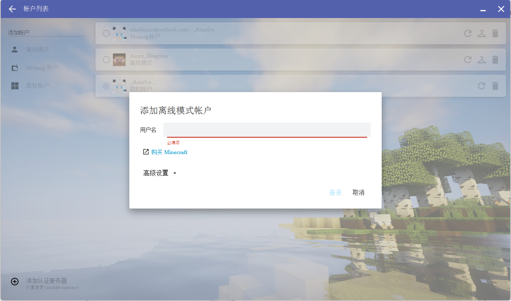

- **Mojang 账户**：正版账户，现在正在逐步迁移到 **微软账户** 中。

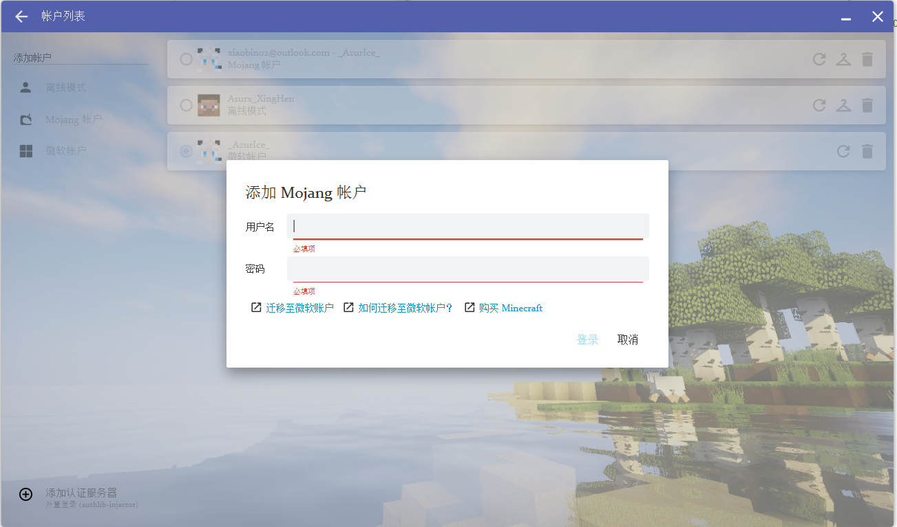

- **微软账户**：正版账户。

设置好账号以后就是选择相应的版本并下载、开始游戏了。

#### 3> 游戏版本安装

**版本列表** 这一栏里面就是当前已安装的所有的游戏版本了

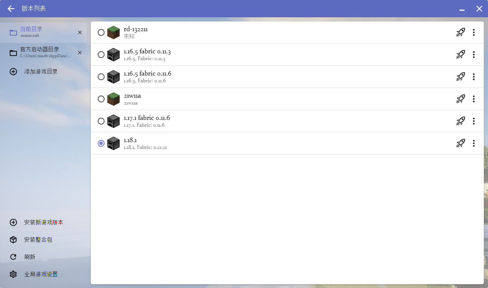

这些游戏版本都保存在启动器所在目录的 `.minecraft/versions/` 中：

安装一个新版本也很简单，选择 *安装新游戏版本*  后会显示一个可供下载的所有版本的列表。

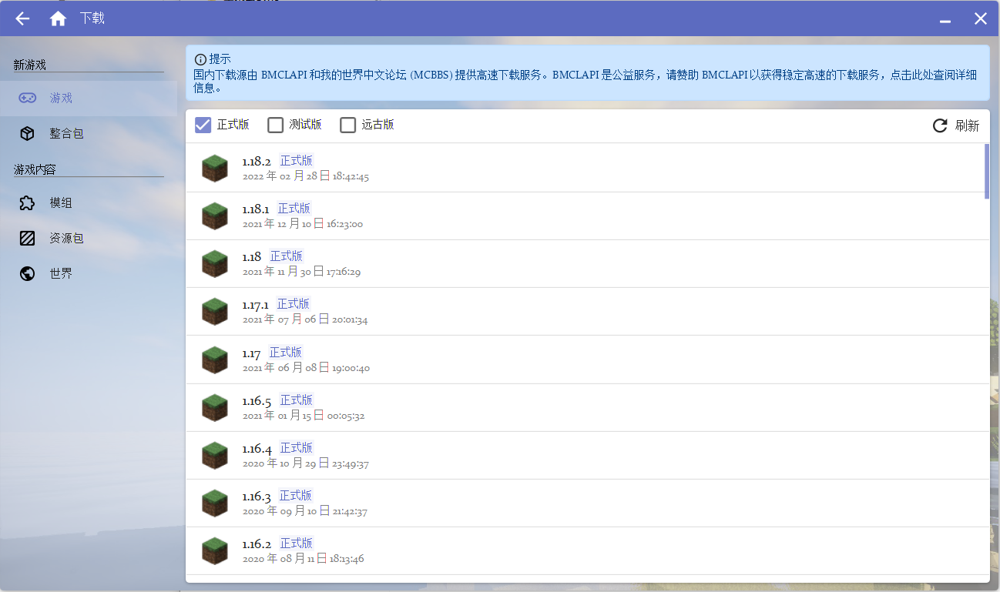

**AzurCraft** 目前的版本是正式版的 <s>1.18.1</s> <s>1.18.2</s> **1.20.2**，随着 Mojang的更新与bug修复，会慢慢跟进。

**小知识 —— 关于测试版（快照版本）的命名**：20w19a 中 20的意思是2020年的后两位20， 19 的意思是这一年的第19周，后面的a(b,c,d......)表示这一周内发布的一个个版本。

选择 <s>1.18.1</s> <s>1.18.2</s> **1.20.2** 继续

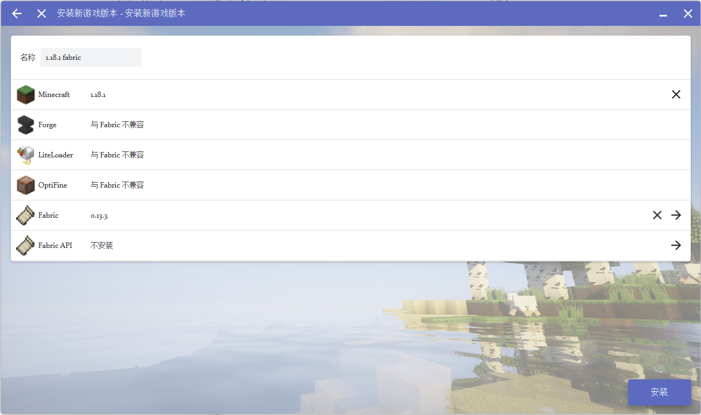

这下面这些东西都可以不装，它们都是一些额外的东西：

- **Fabric** 、 **Forge** 、 **LiteLoader**、**Quilt** 都是用来加载 **mod（模组）** 的：

    **Liteloader** 目前基本不再使用。

    **Forge** 曾经很主流，现在依然很流行，与 **Fabric** 平分天下。

    **Fabric** 是新兴的，轻量模块化。

    **Quilt** 比 **Fabric** 还要新，为了解决 **Fabric** 存在的一些问题而产生。很多 **Fabric** 的 mod 用 **Quilt** 也可以加载（Quilt 对大部分 Fabric 的 mod 都有兼容性）。

- **Fabric API** 是一个 mod，有很多 mod 会用到这个 mod 中提供的 有关游戏内容的 API。

- **Optifine** 是高清修复，安装后有很多实用的功能如光影、无缝玻璃等以及对游戏帧数的优化。但是它与 **Fabric**/**Quilt** 不兼容。不过 **Fabric**/**Quilt** 下也有对应的 **mod** 可以实现。

作为 **生电（生存电路，不止是指红石，还有一系列的各种科技）**玩家，会经常性的用到一些很实用的 **mod** 比如说：

- **Litematica（俗称投影mod）**可以将玩家设计的建筑、机器等内容保存为原理图，以虚影方式呈现在世界中。
- **Tweakeroo** 内含各种使用工具，如连点、方块朝向选择放置、“灵魂出窍”（FreeCameraView）等功能。
- **Sodium** 用现代技术重写了MC的渲染，对帧数提高极大。
- **Iris** 提供了对光影的支持，与 **Sodium** 配合食用口感更佳。
- ......

而这些都需要借助 **Fabric**/**Quilt** 才能加载，所以 **Fabric**/**Quilt** 要记得装，选最新版本就好啦。

由于目前我们的服务器使用的还是 Fabric，所以目前还是建议使用 Fabric

至于 **Fabric API**，可以选上，或者手动下载也可以（因为它其实是个 mod）。不过服务器有提供打包好的 mod 大礼包，里面就有 **Fabric API**，所以就不用选啦。

等啊等，诶他好了！

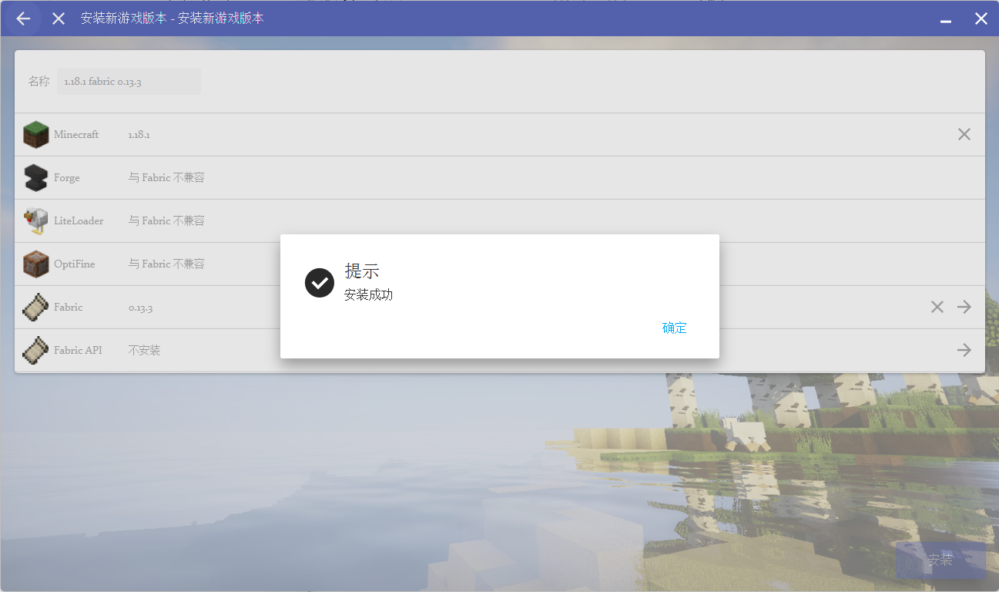

> **Tip**：安装过一个版本之后再安装其他版本会快很多，有相同的资源文件可以共用。

然后我们在版本列表中选中它，再点左上角的箭头返回主页面。

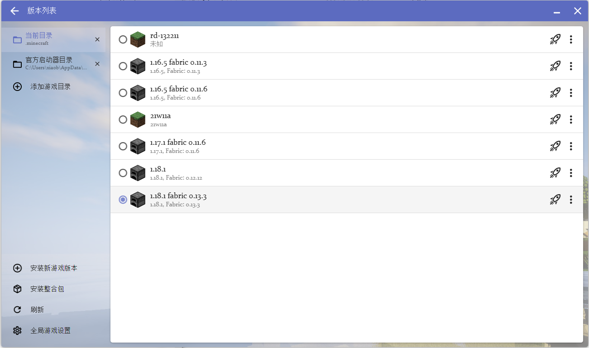

再点击右下的启动游戏就好啦！

## 三、进入 AzurCraft

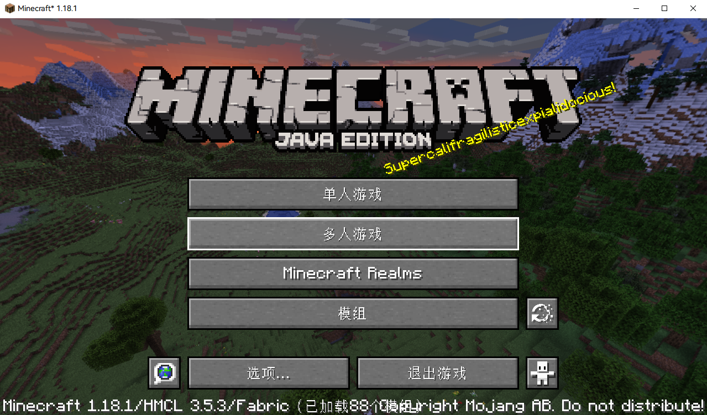

点击多人游戏，添加服务器

服务器名称是自己起的备注，什么都可以，ip内填写`mc.azurcraft.top:25565`，注意是英文冒号！！！！！！！！

点几下刷新就好啦

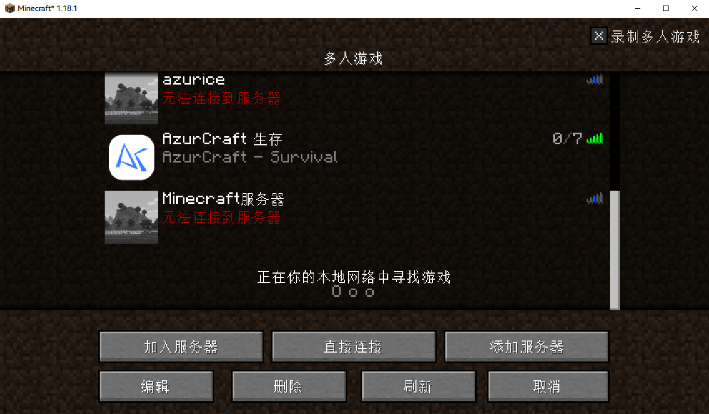

## 四、一些游戏设定

进入到了主界面，左下角的放大镜是调语言的地方

简体中文在最下面

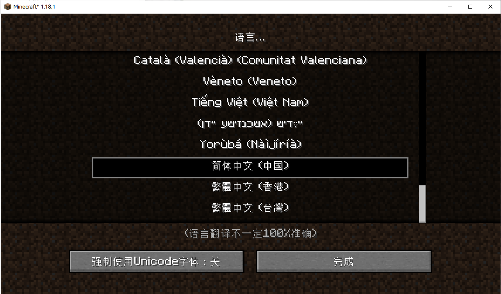

然后选项中是这样的，（角视场我比较习惯90，这样视野比较大，可以进入游戏以后再试试）

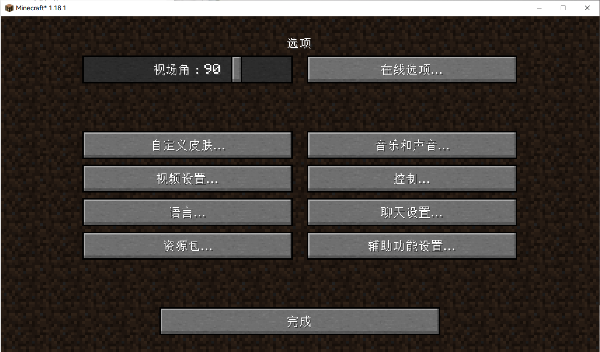

控制里面建议关掉自动跳跃，有时很妨碍操作。

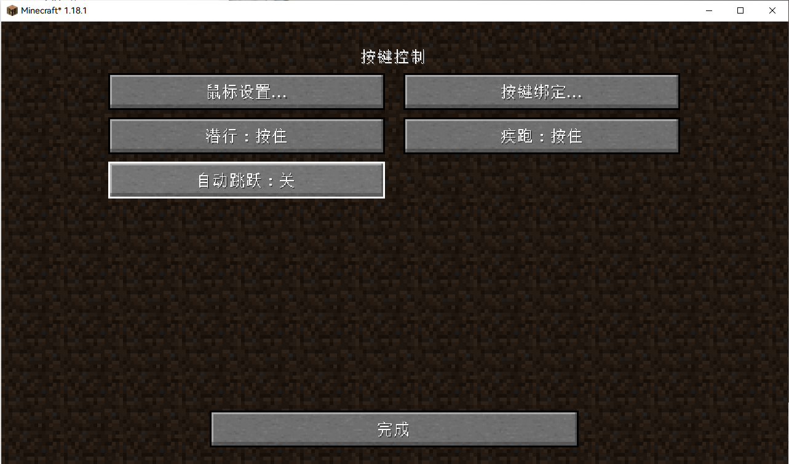

## 五、一些可能会遇到的问题

还真挺多的再找 [@Azur冰弦](https://github.com/AzurIce) 问就好了（滑稽

## 六、MC Java版 - `.minecraft/`  的那些事

这是启动器的文件夹，游戏内容全部都存放在 `.minecraft/` 中，要想真正与MC Java版深入♂交流(划掉)，需要对它有所理解。

这是我的 `.minecraft/` 文件夹内部：

### 1、一些通常不用去管的文件夹

- `assets/` - 游戏的一些资源文件
- `libraries/` - 游戏运行所需的一些库
- `logs/` - 游戏运行时的一些记录文件(可以理解成程序的日记，在xx:xx做了xx)

### 2、一些经常用到的文件夹

#### 1> `saves/` - 游戏的存档存放的位置  

每一个游戏存档都是以一个文件夹的形式存放的，这是它里面的样子

乱起八糟这一大坨其实暂时还不会用到，不过既然他是存档，那么当然就可以用复制的方法来转移/备份存档。
比如别人给我发了个压缩文件，里面是存档：

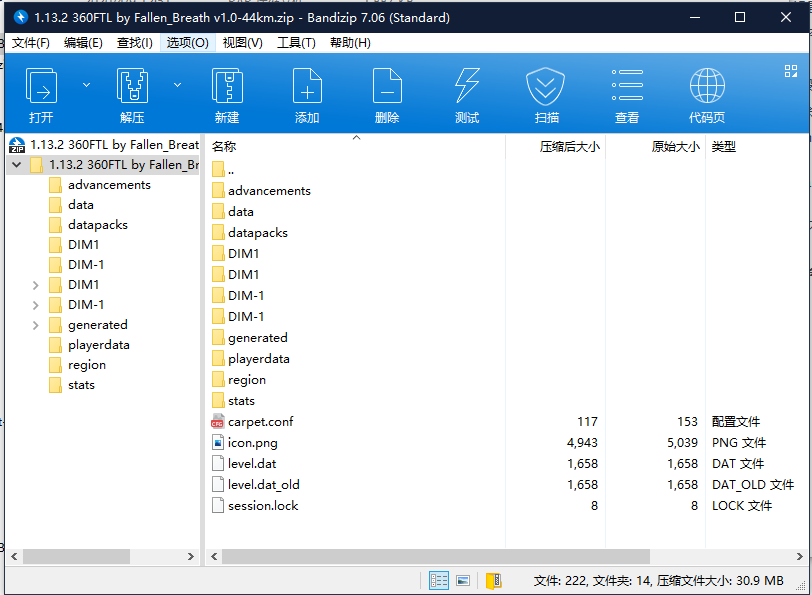

那么我把它解压出来（一个文件夹里面是一大坨东西），再丢到saves里面，就可以在游戏里看到啦。

#### 2> `resourcepacks/` - 资源包（材质包）的存放位置 

资源包就是告诉MC里面每一个方块长什么样子的一个压缩文件。

 一个材质包长这样：

把它直接丢到 `resourcepacks/` 里面，不用解压，进入游戏后在选项 - 资源包里面选上就好啦。  

#### 3> `versions/` - 各个版本的游戏文件

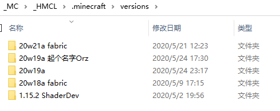

每个版本里面都有个 `.jar` 文件，这个就是游戏本体，运行游戏运行的就是这个文件。

这些版本默认是共用刚讲到的 `saves/` , `resourcepacks/` 等文件夹的，不过有时候为了防止各个版本之间存档、资源包等内容混乱，会在启动器的 全局游戏设置 里打开一个叫做 各版本独立 的选项：

游戏列表 - 全局游戏设置 

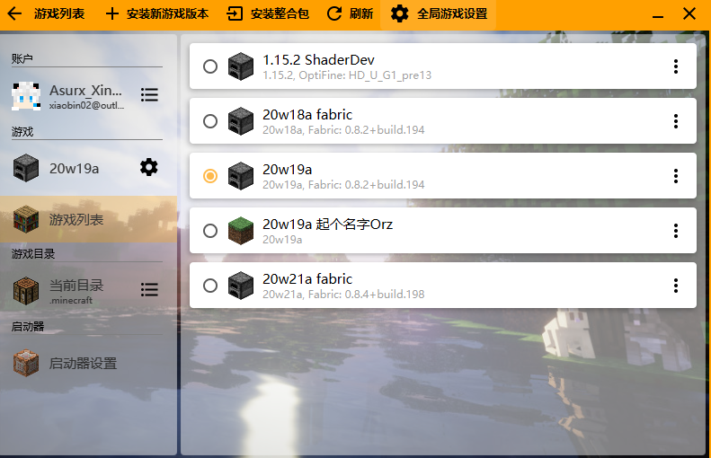

运行路径 - 各版本独立 

打开后再启动游戏的话，每个版本的游戏并不是加载 `.minecraft/` 中的 那些东西 ，而是每个游戏版本文件夹内的 `saves/` ， `resourcepacks/` 等等。

就变成像这样：

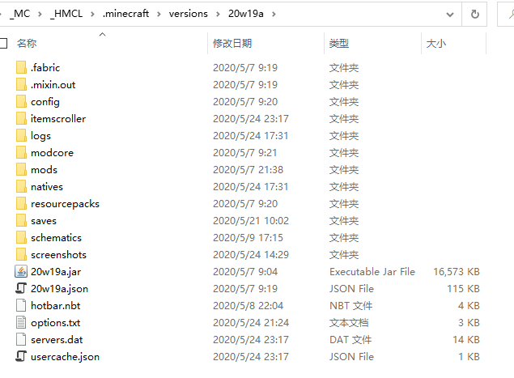

也就是说，不开版本独立的时候，存档、资源包等东西都是共用的 `.minecraft/` 中的内容：

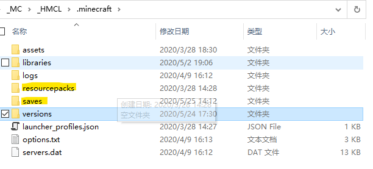

打开以后，用的就是自己版本文件夹下的内容：

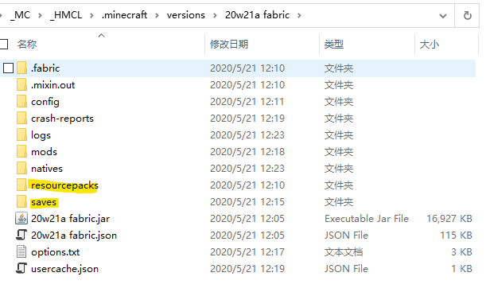